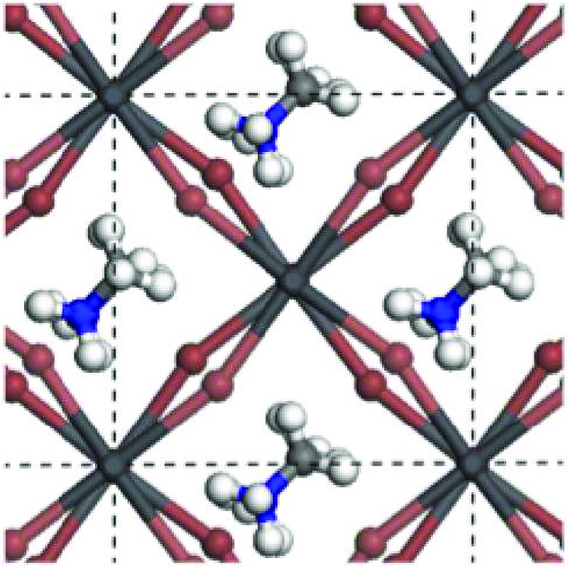
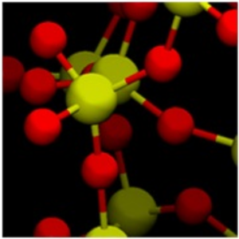
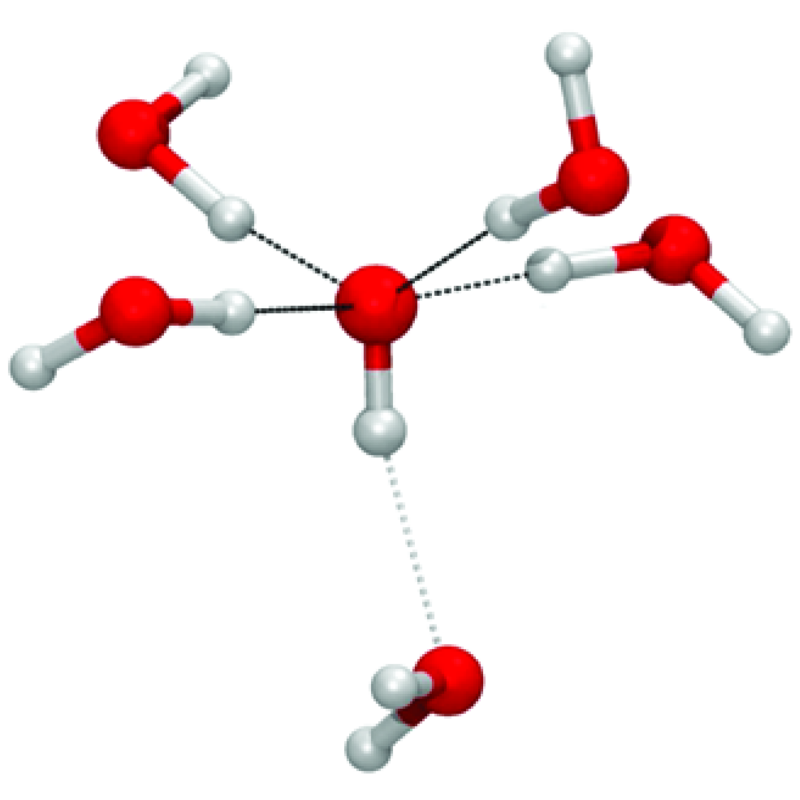

# Minimum Chips
Angus Gray-Weale
2024-10-04

[How many chips is the
minimum?](https://www.abc.net.au/news/2019-12-21/minimum-chips-size-debate-brandon-gatgens/11772776)

Minimum chips implements mathematical operations on a large array for
use with high performance computing systems.

The array is split into blocks, each one of which is shared between one
or more MPI processes. The code is optionally accelerated with OpenMP
pragmas.

Both Monte-Carlo simulations of material properties, and solvers for
integral equations for the structures of fluids have been built on the
foundation implemented in `minimum_chips`.

The most expensive step in the solution of integral equations for the
structures of fluids of particles with internal structure is ideal for
GPGPU acceleration. CUDA is used for this step.

